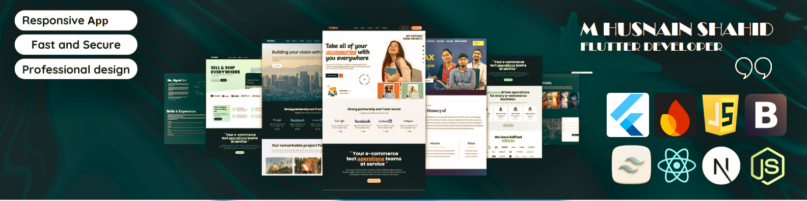

<!-- Banner / Header -->

  

  
  
  

---

## 🎯 About Me  

<table>
  <tr>
    <td width="60%" valign="top">

🚀 **Mobile Application Developer** | 🔥 **Flutter Enthusiast** | 🎨 **UI/UX Designer**  

- 😄 Pronouns: **he/him**  
- 👀 Love: Flutter development, debugging, & intuitive UI/UX  
- 🌱 Learning: **Advanced Flutter Debugging + Backend (Node.js)**  
- 💞️ Collab: Open-source & innovative app ideas  
- 🏗️ Exp: Startups & full-scale apps  
- 🔹 Skilled: **C, C++, Java, DSA, Dart, Flutter**  
- 🎨 Focused on: **Native-like modern UI**  
- ⚡ Fun Fact: I debug code faster than I cook dinner 😆  

    </td>
    <td width="40%" align="center">

    
  </tr>
</table>

---

## 🔭 Current Focus  
- 🚀 Building **cross-platform mobile apps** with Flutter  
- 🌱 Learning **MERN + Backend Dev (Node.js, Express, MongoDB)**  
- 💡 Exploring **UI/UX principles** for next-level user experience  

---

## 🌐 Socials

---

## 🏆 GitHub Trophies

---

## 💻 Tech Stack

### 📱 Mobile & Frontend

### 🔧 Backend & Databases

### ☁️ Cloud & Deployment

### 🛠️ Tools & Technologies

---

## 📊 GitHub Stats

|  |  |
| --- | --- |

  

  

---

### ✍️ Random Dev Quote

---

## 🌟 Featured Projects  

<table>
<tr>
<td width="50%">
<h3 align="center">📱 Flutter E-Commerce App</h3>

Complete store app with modern UI + Firebase backend

<b>Flutter, Dart, Firebase</b>

</td>
<td width="50%">
<h3 align="center">🚕 Taxi Booking App UI</h3>

Flutter-based UI for ride-hailing apps

<b>Flutter, Dart, Google Maps API</b>

</td>
</tr>
<tr>
<td width="50%">
<h3 align="center">🤖 ChatGPT Bot in C++</h3>

Console chatbot showcasing AI basics

<b>C++</b>

</td>
<td width="50%">
<h3 align="center">🛒 MERN Stack Store App</h3>

Full-stack app with authentication & CRUD

<b>MongoDB, Express, React, Node.js</b>

</td>
</tr>
</table>

---

### 🔝 Top Contributed Repo

---

<!-- Snake Game Animation -->

  

---

  

---

